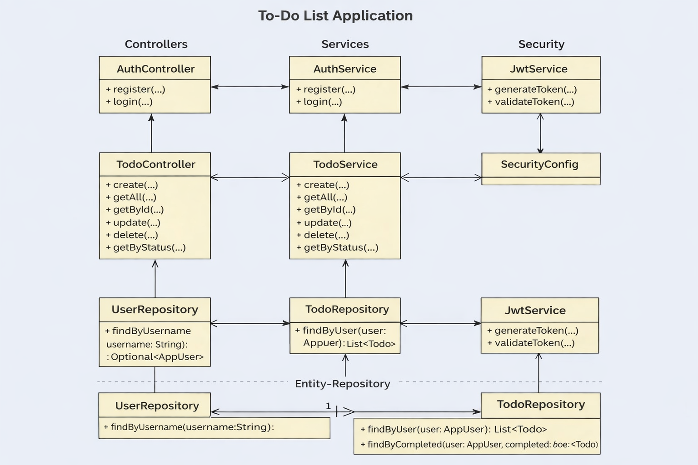

# 🧩 Backend - ToDo List Application

This document describes the backend implementation of the ToDo List application built with **Spring Boot** and **JWT Authentication**.

---

## 🚀 Technologies Used

* Java 17
* Spring Boot
* Spring Security
* JWT (JSON Web Token)
* Spring Data JPA
* PostgreSQL
* Swagger (OpenAPI)

---

## 🔐 Authentication

The application uses **JWT-based authentication**.

### Available Endpoints

#### Register

```
POST /auth/register
```

#### Login

```
POST /auth/login
```

After login, a JWT token is returned and must be included in requests:

```
Authorization: Bearer <your_token>
```

---

## 📌 Todo Endpoints

| Method | Endpoint                      | Description      |
| ------ | ----------------------------- | ---------------- |
| POST   | /api/todos                    | Create new todo  |
| GET    | /api/todos                    | Get all todos    |
| GET    | /api/todos/get/{id}           | Get todo by id   |
| PUT    | /api/todos/update/{id}        | Update todo      |
| DELETE | /api/todos/delete/{id}        | Delete todo      |
| GET    | /api/todos/status/{completed} | Filter by status |

---

## 🧪 Swagger UI

You can test all endpoints using Swagger:

```
http://localhost:8080/swagger-ui/index.html
```

---

## 🗄️ Database Configuration

Example `application.properties`:

```
spring.datasource.url=jdbc:postgresql://localhost:5432/todo_db
spring.datasource.username=postgres
spring.datasource.password=1234

spring.jpa.hibernate.ddl-auto=update
spring.jpa.show-sql=true
```

---

## 🧩 Project Structure

```
controllers/
services/
repository/
entity/
dto/
security/
```

---

## 📊 UML Diagram


---

## 🎯 Features

* User registration & login
* JWT authentication & authorization
* Secure REST API
* Todo CRUD operations
* User-based data access
* Swagger API documentation

---

## 📌 Notes

* All `/api/**` endpoints require authentication
* `/auth/**` endpoints are publicly accessible
* Swagger is enabled for API testing

---

## 👩‍💻 Author

Backend developed by Nazlım Aynacı
