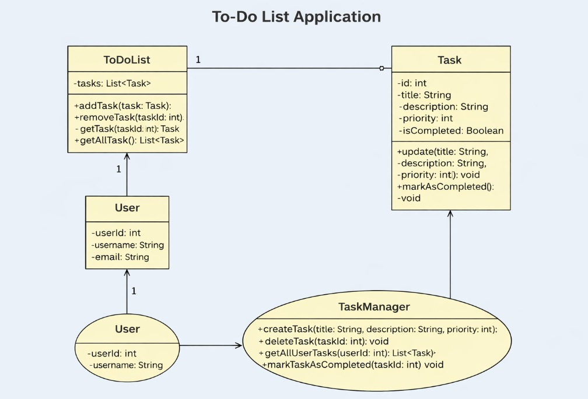

# 📝 To-Do List Application

## 📖 Project Overview

This project is a web-based To-Do List application developed as part of our course requirements.

The purpose of this project is to allow users to:
- Add tasks
- Edit tasks
- Delete tasks
- Mark tasks as completed

In addition to software development, this project demonstrates teamwork, project planning, and task management using Jira.

---

## 👥 Group Members & Roles

- Ömer Saydamoğlı – Project Manager & Backend Developer  
- Nazlım Aynacı – Frontend Developer & UI/UX Designer  
- Talha Soydaş – System Analyst & Integration Developer  

---

## 🛠 Technologies Used

- HTML  
- CSS  
- JavaScript  
- GitHub (Version Control)  
- Jira (Task Management)  
- Google Teams (Communication)  
- Draw.io / PlantUML (UML Diagram)

---

## 📋 Project Management

All team members created:
- One Jira account  
- One Google Teams account  

The instructor has been added as a **Watcher** in Jira.

All task distribution, sprint planning, and progress tracking are managed via Jira.

---

## 🗓 Project Timeline

| Week | Activities |
|------|------------|
| Week 1 | Project planning & requirement analysis |
| Week 2 | UML diagram & system design |
| Week 3 | Frontend development |
| Week 4 | Backend logic implementation |
| Week 5 | Testing & integration |
| Week 6 | Final revisions & submission |

---

## 💰 Budget & Resource Planning

[Proje Planı Excel Dosyası İçin Tıklayın](project-planning.xlsx.xlsx)

### 👨‍💻 Team Members
3 Members

### ⏳ Estimated Duration
6 Weeks

### 🕒 Estimated Workload
- 40 hours per member  
- Total: 120 hours  

Detailed resource, time, and member planning is provided in the attached Excel document.

---

## UML Diagramı

---

## 📂 Repository Information

The project has been uploaded to GitHub as required.  
All documentation, UML diagrams, and project files are included.

The GitHub repository link has been shared with the instructor via UBIS.

---

## 📄 License

This project is developed for educational purposes.
